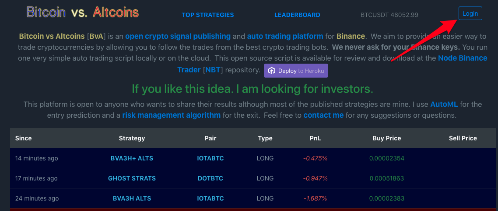
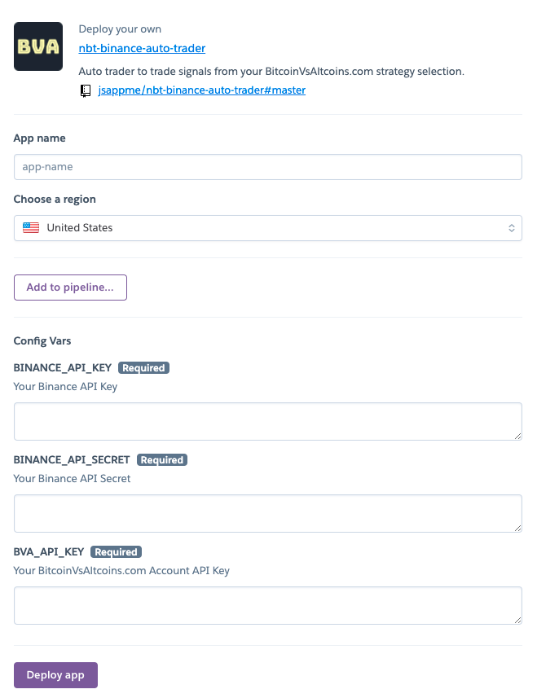
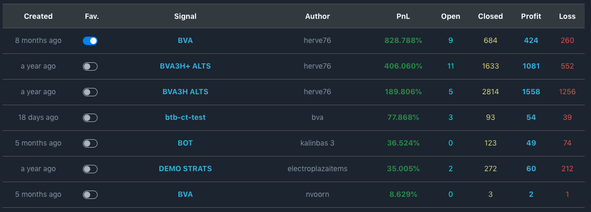
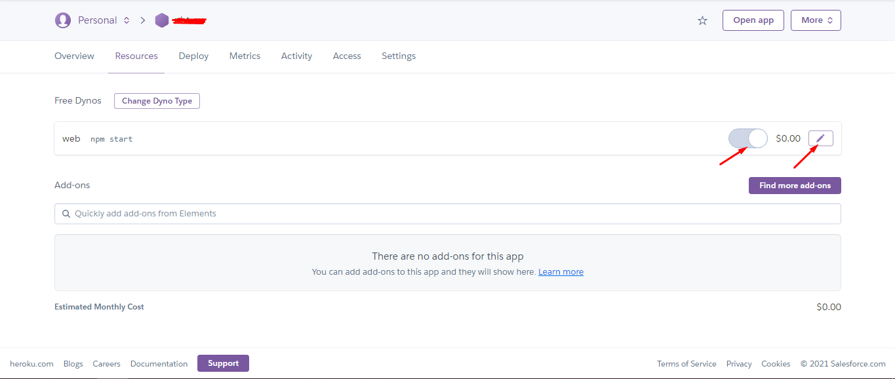
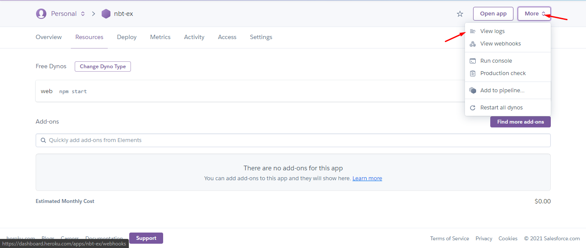
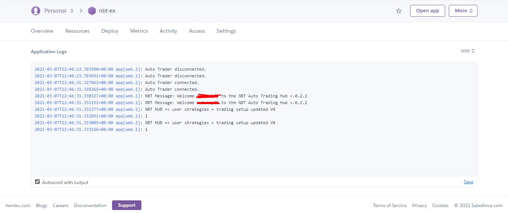
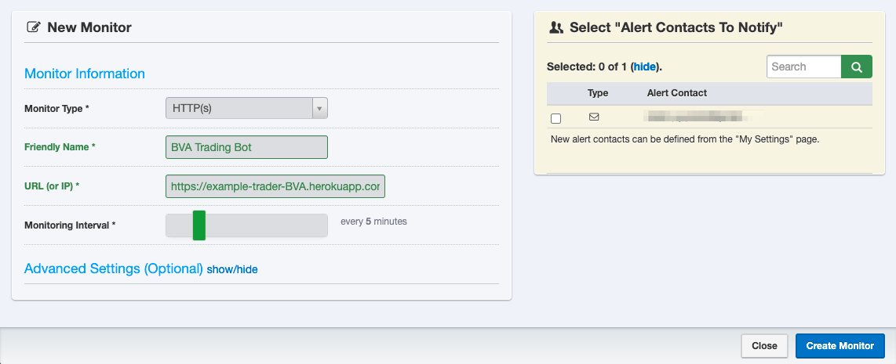
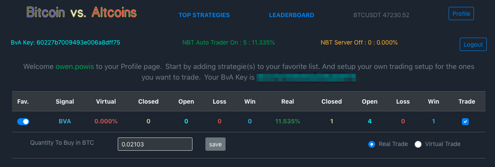

# Getting started

This step by step guide will help you get your account up and running with the popular BVA strategy.

The total time to complete this guide should be less than 10 minutes if you already have a Binance account registered with funds. If not, it will take a little longer just to get yourself set up on Binance and transfer your funds in.

## Table of contents

1. **[How to get started](#how-to-get-started)**
1. **[Setting up your own personal trading bot](#setting-up-your-own-personal-trading-bot)**
1. **[Getting it running](#getting-it-running)**
1. **[Start trading](#start-trading)**
1. **[Keep it trading 24/7](#keep-it-trading-24/7)**
1. **[Additional configuration options](#additional-configuration-options)**
1. **[Common questions](#common-questions)**

## How to get started

First, you need an account with Binance. The registration can be done here: [Binance](https://www.binance.com/en-AU/register?ref=141340247)

By default the trader tries to trade with margin, so you should have at least 0.001 BTC in your spot as well as your margin account. Also, to cover trading fees, you'll need a small amount of BNB in both your spot and margin wallets. You will need to keep an eye on this and top it up periodically. Make sure you have "Using BNB to pay for fees" enabled in your Binance profile to get the discount.

If you want to allow SHORT trades (or borrowing for LONG trades) then you will need to tick the 'Enable Margin' option under the API Management settings in Binance. Then go to your margin wallet and enable the setting for "Using BNB For Interest". You will need to keep enough BNB in your margin wallet to repay any interest. Also, the amount you can borrow is relative to your total margin balance (or equity), so you will need to have enough collateral to support the number of open trades that you expect.

If you use Margin Trading on Binance, please make sure to enable "Using BNB For Interest" like this:

If you need more information on how to set up Binance and the different wallets you can find lots of additional information here: https://www.binance.com/en/support/

More information on how margin loans work in Binance can be found here: https://www.binance.com/en/support/faq/360041505471

You will also need to create an account on [Bitcoin vs. Altcoins](https://bitcoinvsaltcoins.com), which you can do by clicking the login button and choosing the sign up option.

Finally you will need a free [Heroku](https://heroku.com/) account set up, which you can register here: https://signup.heroku.com/
Once you have these accounts set up, you're ready to set up the actual trading!

## Setting up your own personal trading bot

While the Bitcoin vs. Altcoins website itself is closed source, the  automated trading bot called [Node Binance Trader (NBT)](https://github.com/PostmanSpat/node-binance-trader) is open source. It connects to your Binance account via the Binance API and executes the trades on your behalf.

NBT needs to be hosted by yourself, which makes the deployment independent and secure. Luckily this is easy to set up and can be done with one click!

Clicking this button will take you to this screen:

Choose any unique name you like and enter a region. You will then need to retrieve your Binance API keys from Binance. They will need to allow trading and margin wallet access. Follow this guide for more information on how to do so: https://www.binance.com/en/support/faq/360002502072-How-to-create-API

You will find your Bitcoin vs. Altcoins support key in your account here: https://bitcoinvsaltcoins.com/profile

There are other configuration options available, but they can be left blank if you just want to get started. You can always add or change them later, see **[Additional configuration options](#additional-configuration-options)** below.

Once you have filled in these details you can hit *Deploy app* and the app will be created for you.

## Getting it running

Now that you have all the infrastructure set up, you need to decide what strategy you want to follow. In this guide, we are setting up your account for the BVA strategy but you can choose whichever you want. This page is a good place to start: https://bitcoinvsaltcoins.com/topstrats

Use the *Fav.* toggle to select strategies that you like. It's usually wise to judge the performance of any strategy against the value of just holding bitcoin.

Some strategies (such as BVA) aim to accumulate BTC, so there will only be trades against BTC. Other community strategies are available that accumulate different altcoins.

Another key metric to look for is how many positions have closed in profit vs. those that have closed in loss.

Once you have selected your strategies you will see that they are now present in your profile:

Here you can choose if you want to trade for real or paper trade (with virtual money), as well as the amount from your Binance account which you want to trade with*. Please note, this is the amount the bot will use per trade and there can be multiple open trades at once. A sensible approach may be start with this value set at 10% of the value you want to trade with. You'll also need to check the *trade* box to make the signal live.

*The trader has several options for calculating the amount to trade, see the additional configuration options below.

You're almost done.

## Start trading

Log into your Heroku account and open your deployed app:

To make sure it is running, go to Resources tab and check if the dyno is switched to on.

Let's check if the bot is running from the logs. You also can check detailed information about the bot from those logs.

This is an example of how it looks if the bot is running. Make sure to switch from All process to Web.

You can also access the log and other diagnostics via the webservice (e.g. https://example-trader-BVA.herokuapp.com/log). Refer to the **[README File 📖](../README.md)** for all options.

## Keep it trading 24/7

Now you are officially up and running! However there is one last task to do. As you are on the free plan, Heroku will close your app if it's not used every 20 minutes. This means your bot will stop trading. You can either upgrade to a paid plan, which prevents this from happening, or you can remain on the free tier with two simple steps.

### Step 1

Heroku only gives dyno's on its free tier 550 hours of run time per month. This is just short of what you will need to keep your new trading bot up and running 24/7. But by simply adding your credit card to your Heroku account your allowance is extended to 1000 hours, which is plenty. Now all you need to do is stop your dyno from falling asleep. This can be easily achieved by regularly pinging its URL.

### Step 2

Go to https://uptimerobot.com/ and register for a free account. Once you have done this you will need to set up a new monitor. To do this use the *+ Add New Monitor* button and choose HTTP(s) from the drop down:

You can find the URL within your Heroku settings:

Once you have created this monitor, you're done! Now you have a live trading bot running your chosen strategy.

## Additional configuration options

Using the Config Vars in Heroku (an environment variable configuration file) you can configure any of the following options. See the **[README File 📖](../README.md)** for more details on what the trader features do.

To add new Config Vars in Heroku:
1. Go to **Settings**
1. Click **Reveal Config Vars**
1. Enter the **Key** and **Value**
1. Click **Add**

**External Notifications**
| Key | Value Format | Description |
| --- | --- | --- |
| IS_NOTIFIER_GMAIL_ENABLED | true / false | Selects if Gmail will be used (Enable less secure apps https://myaccount.google.com/lesssecureapps) |
| NOTIFIER_GMAIL_ADDRESS | email address | Gmail email to get notifications |
| NOTIFIER_GMAIL_APP_PASSWORD | string | Gmail password to get notifications |
| IS_NOTIFIER_TELEGRAM_ENABLED | true / false | Selects if Telegram will be used
| NOTIFIER_TELEGRAM_API_KEY | string | Telegram Key for your bot (To create one follow https://core.telegram.org/bots#6-botfather)
| NOTIFIER_TELEGRAM_RECEIVER_ID | string | Unique identifier for the target chat (as a number) or username of the target channel (in the format @channelusername)
| NOTIFIER_LEVEL | info / success / warn / error | Minimum level of notifications that will be sent

*If you want to use Telegram and don't know your Chat ID, set the NOTIFIER_TELEGRAM_RECEIVER_ID to a dummy value, start the trader (you will see errors in the log), then use the /info command in Telegram and it will respond with the ID that you can use.*

**Trader Features**
| Key | Value Format | Description |
| --- | --- | --- |
| IS_BUY_QTY_FRACTION | true / false | Uses the 'Quantity to Buy' from the NBT Hub as a fraction of your wallet balance (e.g. 0.1 is 10%) |
| TRADE_LONG_FUNDS | borrow min / borrow all / sell all / sell largest | See README for explanation |
| PRIMARY_WALLET | margin / spot | Primary wallet to execute LONG trades, it may still swap to the other if there are insufficient funds |
| WALLET_BUFFER | decimal number >= 0 and < 1 | Decimal fraction of the total balance of each wallet that should be reserved for slippage, spread, and bad short trades (e.g. 0.1 is 10%) |
| MAX_SHORT_TRADES | integer >= 0 | Maximum number of SHORT trades that can be open concurrently (i.e. limit your borrowing), zero is no limit |
| MAX_LONG_TRADES | integer >= 0 | Maximum number of LONG trades that can be open concurrently (i.e. limit borrowing or rebalancing), zero is no limit |
| EXCLUDE_COINS | coin, coin, coin | Comma delimited list of coins to exclude from trading (e.g. DOGE) |
| STRATEGY_LOSS_LIMIT | integer >= 0 | Number of sequential losses before a strategy is stopped |
| IS_TRADE_SHORT_ENABLED | true / false | SHORT trades will always borrow the full funds in margin to execute, disable if you don't want this |
| IS_TRADE_MARGIN_ENABLED | true / false | Used to disable use of margin wallet trading for both LONG and SHORT trades |
| IS_PAY_INTEREST_ENABLED | true / false | Automatically repays all BNB interest before repaying margin loans |
| BNB_FREE_THRESHOLD | decimal number | Creates a warning if your available BNB balance is below the threshold (too low for fees and interest) |
| TAKER_FEE_PERCENT | decimal number >= 0 | The spot trading Taker Fee as quoted on Binance |
| MIN_COST_BUFFER | decimal number >= 0 | Decimal fraction to increase the minimum trade cost to avoid MIN_NOTIONAL errors |
| VIRTUAL_WALLET_FUNDS | decimal number > 0 | The (roughly) equivalent BTC value used as the default starting balance for all virtual wallets |
| WEB_PASSWORD | string | Password to restrict access to the internal diagnostics webserver |
| TZ | string | Configure your own time zone for display of dates and times (https://en.wikipedia.org/wiki/List_of_tz_database_time_zones) |

*There are a few other internal configuration options available, check the env.ts file for details.*

## Common questions

### How do I know it's running?

You can check into your account to see your progress and see something like this:

"NBT Auto Trader" is the trading bot and this should be on and green. The NBT Server is not needed unless you want to create your own custom strategies and publish them to the BVA page.

If you are seeing "NBT Auto Trader Off" then go back to Heroku to check if the bot is running via log console. If it's on idle or crashed state, you need to restart your dyno.

### Is it secure?

You host the trading bot yourself, which is in itself open source. Meaning anyone can inspect the code. Your Binance API keys are retained on your own instance in Heroku, rather than being shared directly with BVA.

Additionally the default permissions which you use within Binance are set to only allow anything using that API to trade between currencies. Currency cannot be withdrawn from your account.

If you have any concerns about your existing account, you can always use a separate Binance account specifically for using this bot.
